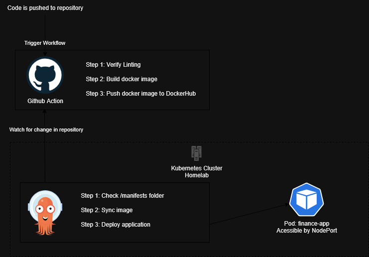
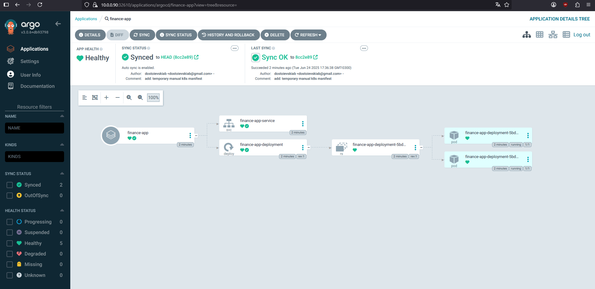

# 💵 Finance App with full CI/CD pipeline
### What is this repository?
Here I want to put in practice a full ci/cd pipeline.
We will use **Github actions** to verify the linting of our code, then build docker image and push it to **Docker Hub**, after that our **ArgoCD** will trigger a sync and deploy the application in a **Kubernetes** cluster running in my homelab.

In this repository you should find:
- Small flask web application where we should be able to add and see our "incomes". It is meant to be simple and quick, based on tutorial from auth0: https://auth0.com/blog/developing-restful-apis-with-python-and-flask
- Github actions yaml files configuration
- Manifests for the kubernetes deployment and service

### Pipeline overview


### ArgoCD setup
Here is the application ArgoCD Yaml:
```yaml
project: default
source:
  repoURL: https://github.com/dostoievskiab/finance-app
  path: manifests
  targetRevision: HEAD
destination:
  server: https://kubernetes.default.svc
  namespace: default
syncPolicy:
  automated:
    selfHeal: true
```


### Running development environment
```bash
# Create virtual env
python3 -m venv venv

# Source it
source ./venv/bin/activate

# Install dependencies
pip install -r requirements.txt

# Run
flask --app src/app.py --debug run
```
Or you can just build the container and run it:
```bash
docker build -t demo-app:v1 .
docker run -d -p 8080:5000 --name demo-app demo-app:v1
```